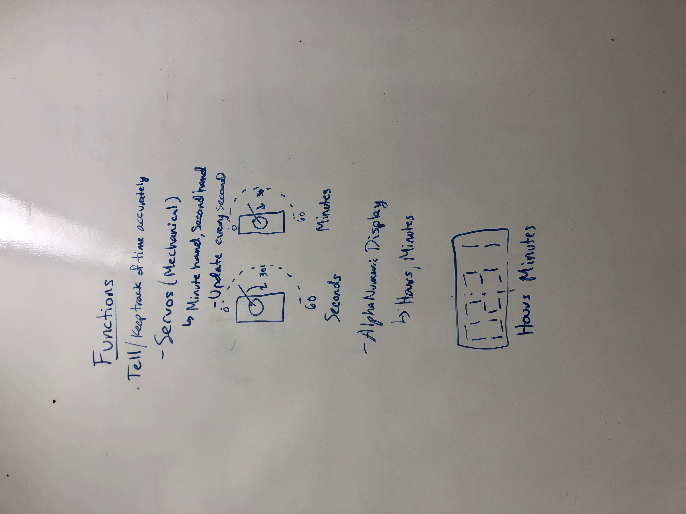
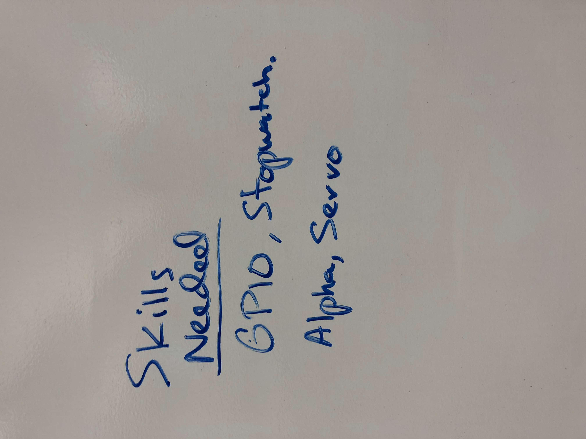
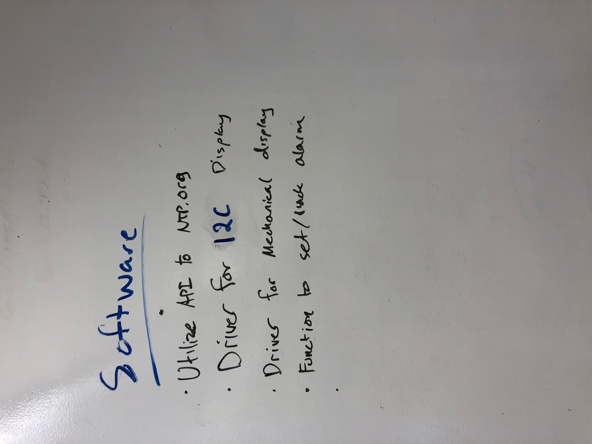
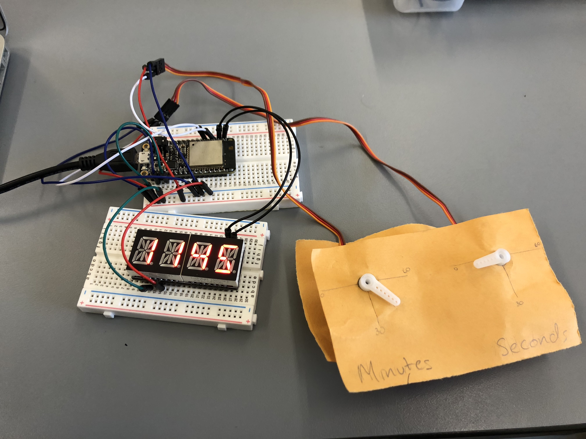

## Digital and Mechanical Alarm Clock
Brian Xu
9/24/18

## Summary

In this project, I was tasked with creating a functioning alarm clock using the Huzzah32 board. This clock includes a I2C display, two MCPWM controlled servos acting as the hands of a clock, interrupt based clock ticks as well as alarm function, and UART based communication with the user of the clock.

## Evaluation Criteria

I decided on the following specifications for a successful solution to this project:
Able to...
  -Tell the hours and minutes from the I2C display
  -Tell the minutes and seconds from the servos
  -Have an alarm with the ability to be set to a time, and be reset/snoozed

## Solution Design

I used the Huzzah32 board (based on the ESP32 board) as the processor for the alarm clock. Connected to the board are the servos acting as clock hands and the I2C AlphaNumeric Display. 

  - Minute Servo -GPIO pin #14 of ESP32
  - Second Servo - GPIO pin #15 of ESP32
  - I2C Display - SDA(23)/SCL(22) of ESP32

The servos use MCPWM to control the alphanumeric display, I used uart communication to accept the reset command.

## Sketches and Photos

 Design Functions

 Skills Needed

 Software Design

 Final Design

## Modules, Tools, Source Used in Solution

- ESP32 MCPWM Servo Control Example (https://github.com/espressif/esp-idf/tree/17ac4bad7381e579e5a7775755cc25480da47d97/examples/peripherals/mcpwm/mcpwm_servo_control)
- ESP32 Timer Group Example (https://github.com/espressif/esp-idf/tree/17ac4bad7381e579e5a7775755cc25480da47d97/examples/peripherals/timer_group)
- ESP32 I2C Example (https://github.com/espressif/esp-idf/tree/17ac4bad7381e579e5a7775755cc25480da47d97/examples/peripherals/i2c)

## Supporting Artifacts

- [Youtube video demo](https://www.youtube.com/watch?v=0WtsrWSZVps)
